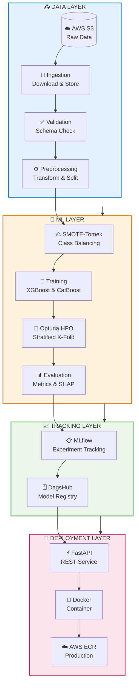
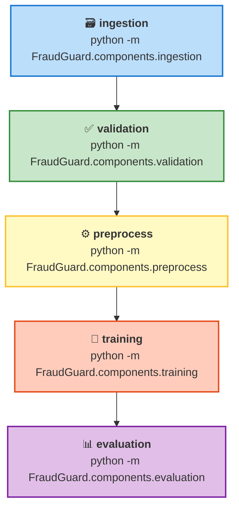

# 🛡️ FraudGuard

<div align="center">

**End-to-End Bank Transaction Fraud Detection System**

[](https://python.org)
[](https://mlflow.org)
[](https://dvc.org)
[](https://fastapi.tiangolo.com)
[](https://docker.com)

*A production-grade ML pipeline for detecting fraudulent bank transactions with modern MLOps practices*

</div>

---

## 🏗️ Architecture Overview



---

## 🔄 DVC Pipeline Stages



> 💡 **Pro Tip:** Run `dvc repro` to execute the pipeline. DVC caches completed stages, so if training fails, just fix the error and run `dvc repro` again - it resumes from where it stopped!

---

## ⚡ Quickstart

### Prerequisites
- Python 3.9+
- AWS credentials (for S3 data access)
- Git & DVC installed

### 1️⃣ Clone & Setup
```bash
git clone https://github.com/JavithNaseem-J/FraudGuard.git
cd FraudGuard

# Create virtual environment
python -m venv venv
source venv/bin/activate  # Windows: venv\Scripts\activate

# Install dependencies
pip install -r requirements.lock
```

### 2️⃣ Configure Environment
```bash
# Windows PowerShell
$env:AWS_PROFILE = "your-aws-profile"
$env:AWS_REGION = "us-east-1"
$env:MLFLOW_TRACKING_USERNAME = "your-dagshub-username"
$env:MLFLOW_TRACKING_PASSWORD = "your-dagshub-token"

# Linux/Mac
export AWS_PROFILE=your-aws-profile
export AWS_REGION=us-east-1
export MLFLOW_TRACKING_USERNAME=your-dagshub-username
export MLFLOW_TRACKING_PASSWORD=your-dagshub-token
```

### 3️⃣ Run Pipeline
```bash
# Run full pipeline with caching
dvc repro

# Or run individual stages
python -m FraudGuard.components.ingestion
python -m FraudGuard.components.training
```

### 4️⃣ Start Web App
```bash
uvicorn app:app --reload --port 8080
# Navigate to http://localhost:8080
```

---

## 🚀 Key Features

| Feature | Description |
|:--------|:------------|
| 🔄 **DVC Pipeline** | Cached, reproducible ML pipeline with `dvc repro` |
| 📊 **Experiment Tracking** | MLflow + DagsHub for metrics, parameters, artifacts |
| ⚖️ **Class Imbalance** | SMOTE-Tomek hybrid resampling (train only, no leakage) |
| 🔧 **HPO** | Optuna with Stratified K-Fold cross-validation |
| 🧠 **Interpretability** | SHAP feature importance plots |
| 🎯 **Dynamic Threshold** | Optimal threshold from Precision-Recall curve |
| ⚡ **Production API** | FastAPI with HTML templates |
| 🐳 **Docker Ready** | One-command containerized deployment |

---

## 📁 Project Structure

```
FraudGuard/
├── 📄 app.py                      # FastAPI web application
├── 📄 dvc.yaml                    # DVC pipeline definition
├── 🐳 Dockerfile                  # Container configuration
│
├── 📁 config_file/
│   ├── config.yaml                # Paths and artifact locations
│   ├── params.yaml                # Hyperparameters
│   └── schema.yaml                # Data schema
│
├── 📁 src/FraudGuard/
│   ├── 📁 components/             # 🎯 Pipeline stages (DVC entry points)
│   │   ├── ingestion.py           # S3 data download
│   │   ├── validation.py          # Schema validation
│   │   ├── preprocess.py          # Feature engineering + SMOTE
│   │   ├── training.py            # Model training with HPO
│   │   └── evaluation.py          # Metrics + SHAP plots
│   │
│   ├── 📁 pipeline/
│   │   ├── feature_pipeline.py    # Data processing pipeline
│   │   ├── model_pipeline.py      # Training + evaluation
│   │   └── inference_pipeline.py  # Production inference
│   │
│   ├── 📁 entity/
│   │   └── config_entity.py       # Pydantic config models
│   │
│   └── 📁 utils/
│       ├── helpers.py             # Utility functions
│       └── logging.py             # Custom logger
│
├── 📁 templates/                  # HTML templates for web UI
├── 📁 artifacts/                  # Generated outputs (DVC tracked)
└── 📁 tests/
    └── test_core.py               # Unit tests
```

---

## 🧪 Testing

```bash
# Windows PowerShell
$env:PYTHONPATH = "src"
pytest tests/test_core.py -v

# Linux/Mac
PYTHONPATH=src pytest tests/test_core.py -v
```

---

## 🐳 Docker Deployment

```bash
# Build
docker build -t fraudguard .

# Run
docker run -p 8080:8080 \
  -e AWS_PROFILE=your-profile \
  -e MLFLOW_TRACKING_USERNAME=your-username \
  -e MLFLOW_TRACKING_PASSWORD=your-token \
  fraudguard
```

---

## 📈 Model Performance

| Metric | Description |
|:-------|:------------|
| 🎯 **F1 Score (Weighted)** | Primary optimization target |
| ⚖️ **Precision / Recall** | Managed via optimal threshold |
| 📈 **AUC-ROC** | Overall discrimination ability |
| 🔲 **Confusion Matrix** | Visual prediction analysis |
| 🧠 **SHAP Plots** | Feature importance & interpretability |

---

## ⚙️ Configuration

### `config_file/params.yaml`
```yaml
train_test_split:
  test_size: 0.2
  random_state: 42

cross_validation:
  cv_folds: 5
  scoring: f1
  n_iter: 20      # Optuna trials
  n_jobs: -1      # Parallel jobs
```

---

## 🔧 DVC Commands Reference

| Command | Description |
|:--------|:------------|
| `dvc repro` | Run full pipeline (cached) |
| `dvc repro training` | Run up to training stage |
| `dvc repro -s training` | Run only training stage |
| `dvc dag` | View pipeline DAG |
| `dvc metrics show` | Show evaluation metrics |
| `dvc plots show` | Generate metric plots |

---

## 📄 License

This project is licensed under the [MIT License](LICENSE).

---

<div align="center">

**Built with ❤️ for Production ML**

[⬆ Back to Top](#️-fraudguard)

</div>
