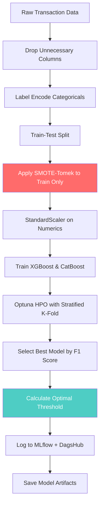

# 🛡️ FraudGuard

**End-to-End Bank Transaction Fraud Detection System**

A production-grade machine learning pipeline for detecting fraudulent bank transactions. Built with modern MLOps practices including experiment tracking, data versioning, and automated CI/CD deployment.

---

## 📊 Architecture Overview

```mermaid
flowchart LR
    subgraph Data Pipeline
        A[S3 Bucket] -->|Download| B[Data Ingestion]
        B --> C[Data Validation]
        C --> D[Data Transformation]
    end
    
    subgraph ML Pipeline
        D -->|Train/Test Split| E[SMOTE-Tomek Resampling]
        E --> F[Model Training]
        F -->|XGBoost / CatBoost| G[Hyperparameter Optimization]
        G --> H[Model Evaluation]
    end
    
    subgraph Deployment
        H -->|Best Model| I[MLflow Registry]
        I --> J[FastAPI Service]
        J --> K[Docker Container]
        K --> L[AWS ECR]
    end
```



---

## 🔄 ML Pipeline Flow



> **Note:** SMOTE-Tomek is applied **only to training data** to prevent data leakage. The optimal threshold is calculated using the Precision-Recall curve and saved as an artifact.

---

## 🚀 Key Features

| Feature | Description |
|---------|-------------|
| **Full ML Lifecycle** | Ingestion → Validation → Transformation → Training → Evaluation → Inference |
| **Experiment Tracking** | MLflow + DagsHub for logging metrics, parameters, and artifacts |
| **Data Versioning** | DVC for versioning datasets and pipeline outputs |
| **Class Imbalance Handling** | SMOTE-Tomek hybrid resampling for fraud detection |
| **Hyperparameter Optimization** | Optuna with Stratified K-Fold cross-validation |
| **Model Interpretability** | SHAP feature importance plots |
| **Dynamic Thresholding** | Optimal threshold calculated during training, not hardcoded |
| **Production API** | FastAPI with form handling and HTML templates |
| **CI/CD** | GitHub Actions → Docker → AWS ECR deployment |

---

## 📁 Project Structure

```
FraudGuard/
├── app.py                      # FastAPI web application
├── main.py                     # CLI pipeline runner
├── Dockerfile                  # Container configuration
├── dvc.yaml                    # DVC pipeline definition
├── config_file/
│   ├── config.yaml             # Paths and artifact locations
│   ├── params.yaml             # Hyperparameters and settings
│   └── schema.yaml             # Data schema definition
├── src/FraudGuard/
│   ├── components/
│   │   ├── ingestion.py        # S3 data download
│   │   ├── validation.py       # Schema validation
│   │   ├── preprocess.py       # Feature engineering + SMOTE
│   │   ├── training.py         # Model training with HPO
│   │   └── evaluation.py       # Metrics + SHAP plots
│   ├── pipeline/
│   │   ├── feature_pipeline.py # Data processing pipeline
│   │   ├── model_pipeline.py   # Training + evaluation pipeline
│   │   └── inference_pipeline.py # Production inference
│   ├── entity/
│   │   └── config_entity.py    # Pydantic config models
│   └── utils/
│       ├── helpers.py          # Utility functions
│       └── logging.py          # Custom logger
├── templates/                  # HTML templates for web UI
└── tests/
    └── test_core.py            # Core unit tests
```

---

## 🛠️ Installation

### 1. Clone the Repository
```bash
git clone https://github.com/JavithNaseem-J/FraudGuard.git
cd FraudGuard
```

### 2. Create Virtual Environment
```bash
python -m venv venv
source venv/bin/activate  
```

### 3. Install Dependencies
```bash
pip install -r requirements.lock
```

### 4. Set Environment Variables
```bash
export AWS_PROFILE=your-aws-profile        
export AWS_REGION=us-east-1
export MLFLOW_TRACKING_USERNAME=your-dagshub-username
export MLFLOW_TRACKING_PASSWORD=your-dagshub-token
```

---

## ▶️ Usage

### Run Full Pipeline
```bash
python main.py
```

### Run Individual Stages
```bash
python main.py --stage feature_pipeline   # Data processing only
python main.py --stage model_pipeline     # Training + evaluation only
```

### Start Web Application
```bash
python app.py
# Or with uvicorn:
uvicorn app:app --reload --port 8080
```

Then navigate to `http://localhost:8080` to access the prediction interface.

---

## 🧪 Testing

```bash
# Set Python path and run tests
$env:PYTHONPATH="src"; pytest tests/test_core.py -v
```

---

## 🐳 Docker Deployment

```bash
# Build image
docker build -t fraudguard .

# Run container
docker run -p 8080:8080 fraudguard
```

---

## 📈 Model Performance

The model is evaluated using multiple metrics suitable for imbalanced fraud detection:

| Metric | Description |
|--------|-------------|
| **F1 Score (Weighted)** | Primary optimization target |
| **Precision/Recall** | Trade-off managed via optimal threshold |
| **AUC-ROC** | Overall discrimination ability |
| **Confusion Matrix** | Visual analysis of predictions |

---

## 🔧 Configuration

### `config_file/params.yaml`
```yaml
train_test_split:
  test_size: 0.2
  random_state: 42

cross_validation:
  cv_folds: 5
  scoring: f1
  n_iter: 20
  n_jobs: -1
```


---

## 📄 License

This project is licensed under the [MIT License](LICENSE).

---

