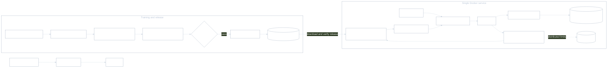

# FraudGuard

**Chronological transaction fraud scoring with cost-aware thresholding, FastAPI inference, and a React dashboard.**

🚀 **Live:** [Click Here](https://fraudguard-gapd.onrender.com)

## Problem

Fraud labels are imbalanced, and missing a fraudulent transaction has a different cost from raising a false alert. FraudGuard evaluates transaction scoring on later chronological data and reports cost-weighted results. It is a demonstration project, not an automated payment-blocking system.

## Features

- Chronological train, validation, and test splits that keep equal transaction-time groups together.
- Validation-based threshold selection and held-out fraud metrics with configurable error costs.
- FastAPI scoring for schema-validated transaction rows, with CSV/JSON input in the React interface.
- Dashboard backed by optional sanitized Supabase prediction records.
- DVC benchmark stages and immutable model release support.

## End-to-End System Architecture


```mermaid
%%{init: {"theme":"base","themeVariables":{"background":"transparent","mainBkg":"transparent","clusterBkg":"transparent","clusterBorder":"#94a3b8","primaryColor":"#1f2937","primaryTextColor":"#ffffff","primaryBorderColor":"#94a3b8","lineColor":"#cbd5e1","textColor":"#ffffff"}}}%%
flowchart LR
  subgraph Build[Training and release]
    D[data/train_transaction.csv] --> DVC[DVC benchmark stages]
    DVC --> Split[Chronological train / validation / test]
    Split --> Train[LightGBM pipeline + threshold]
    Train --> Gates{Promotion gates}
    Gates -->|pass| Publish[Release publisher]
    Publish --> Storage[(Private Supabase Storage)]
  end

  subgraph Runtime[Single Docker service]
    User[User browser] --> Web[React + TypeScript UI]
    Web --> API[FastAPI]
    API --> Guard[Request size / batch / rate guards]
    Guard --> Model[Loaded model + feature contract]
    Model --> Result[Scores and fraud flags]
    Result --> Web
    API --> Dash[Dashboard endpoint]
    Dash --> DB[(Supabase Postgres<br/>sanitized prediction records)]
    Guard -. distributed limits .-> Redis[(Upstash Redis)]
  end

  Storage -->|download and verify release| Model
  CI[GitHub Actions CI] --> Image[Docker image]
  Image --> Render[Render]
```

## Model Evaluation and Release Sequence


```mermaid
%%{init: {"theme":"dark","themeVariables":{"textColor":"#ffffff","primaryTextColor":"#ffffff","actorTextColor":"#ffffff","signalTextColor":"#ffffff","labelTextColor":"#ffffff","loopTextColor":"#ffffff","noteTextColor":"#ffffff"}}}%%
sequenceDiagram
  participant Data as Labeled Data
  participant Bench as Benchmark Pipeline
  participant Model as LightGBM Model
  participant Eval as Evaluator
  participant Gate as Promotion Gate
  participant Store as Artifact Store

  Data->>Bench: Provide labeled transaction rows
  Bench->>Bench: Validate, deduplicate, and sort by transaction time
  Note over Bench: Make chronological 70/15/15 splits and keep equal-time groups together
  Bench->>Model: Fit preprocessing and model on training period
  Model-->>Bench: Return fitted pipeline
  Bench->>Eval: Score validation period
  Eval-->>Bench: Select threshold using validation scores
  Bench->>Eval: Score later test period at selected threshold
  Eval-->>Bench: Return held-out metrics
  Bench->>Gate: Check quality, baseline, schema, and artifact gates
  alt All promotion gates pass
    Gate->>Store: Publish immutable model release
  else Any promotion gate fails
    Gate-->>Bench: Block release
  end
  Note over Gate,Bench: Current saved benchmark decision: blocked
```

## REST API

| Method | Endpoint | Purpose |
|---|---|---|
| `GET` | `/live` | Process liveness. |
| `GET` | `/health` | Alias for `/live`. |
| `GET` | `/ready` | Model and dependency readiness; returns `503` if the model is unavailable. |
| `GET` | `/version` | Build commit and build time. |
| `GET` | `/schema/transactions` | Active feature names, threshold, and batch limit. |
| `POST` | `/predict/transactions` | Score a JSON batch of transaction rows. |
| `GET` | `/dashboard` | Sanitized prediction aggregates and recent flagged records. |
| `GET` | `/api` | Service index and API links. |
| `GET` | `/docs` | FastAPI interactive API documentation. |

The UI is also served by the API at `/` and `/score`; `/sample_transactions.csv` serves the demo input file.

## Tech stack

Python, FastAPI, LightGBM, scikit-learn, pandas, React, TypeScript, Vite, Supabase, Upstash Redis, Docker, Render, and DVC.

## Project structure

```text
FraudGuard/
├── app.py                    FastAPI app and frontend serving
├── src/FraudGuard/
│   ├── cloud/                 Settings, artifacts, persistence, rate limiting
│   ├── data/                  Transaction data contract and benchmark
│   ├── monitoring/            Sanitized prediction monitoring reports
│   ├── pipeline/              Model artifact validation and inference
│   └── utils/                 Cost functions and logging
├── frontend/src/              React pages, components, API client
├── scripts/                   Benchmark, release, monitoring, and cleanup commands
├── tests/                     Backend and API tests
├── supabase/migrations/       Database schema migrations
├── .github/workflows/         CI and Render deployment workflows
├── data/                      Local transaction CSVs (git-ignored)
├── artifacts/                 Generated reports and model artifacts (git-ignored)
├── Dockerfile                 Combined frontend and API image
├── dvc.yaml                   Data contract and benchmark stages
└── render.yaml                Render service configuration
```

## Key metrics

On the saved 75,000-row run, the LightGBM candidate was evaluated on the later 11,250-row chronological test split. The most decision-relevant results were:

| Test metric | Value |
|---|---:|
| Average precision | 0.53 |
| Recall | 0.64 |
| Cost-weighted average loss | 0.24 |

Metric values are truncated to two decimal places; promotion uses full precision. The saved report marks promotion **blocked**: all three metrics miss their configured gates (average precision `>= 0.70`, recall `>= 0.70`, average loss `<= 0.20`). Cost uses false-positive cost `1.0` and false-negative cost `20.0`. These are local benchmark results, not live payment performance.

## Setup, run, and use

The model artifacts and training data are excluded from Git. Scoring requires a model bundle at the configured artifact path, or a configured remote release. The benchmark requires `data/train_transaction.csv`.

```powershell
git clone https://github.com/JavithNaseem-J/FraudGuard.git
cd FraudGuard
python -m venv .venv
.venv\Scripts\Activate.ps1
python -m pip install -r requirements-dev.lock
python -m pip install -e . --no-deps
Copy-Item .env.example .env
Set-Location frontend
npm ci
npm run build
Set-Location ..
# Configure a model bundle or remote release in .env before scoring.
python app.py
```


## Future work

- Revise the model or features and rerun the chronological benchmark until the configured promotion gates pass.
- Evaluate the optional identity side-table features; the current benchmark does not use them.

## License

This project is licensed under the [MIT License](LICENSE).
