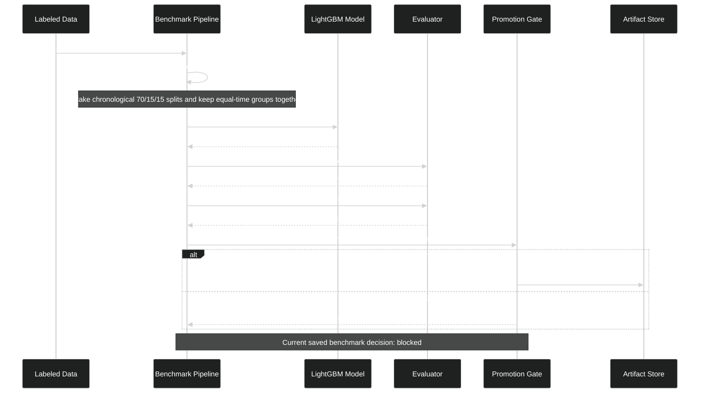

# FraudGuard

**Chronological transaction fraud scoring with cost-aware thresholding, FastAPI inference, and a React dashboard.**

🚀 **Live:** [Click Here](https://fraudguard-gapd.onrender.com)

## Problem

Fraud labels are imbalanced, and missing a fraudulent transaction has a different cost from raising a false alert. FraudGuard evaluates transaction scoring on later chronological data and reports cost-weighted results. It is a demonstration project, not an automated payment-blocking system.

## Features

- Chronological train, validation, and test splits that keep equal transaction-time groups together.
- Bounded validation-only LightGBM tuning and cost-aware threshold selection.
- FastAPI scoring for schema-validated transaction rows, with CSV/JSON input in the React interface.
- Dashboard backed by optional sanitized Supabase prediction records.
- DVC benchmark stages and immutable model release support.

## End-to-End System Architecture


```mermaid
%%{init: {"theme":"base","themeVariables":{"background":"transparent","mainBkg":"transparent","clusterBkg":"transparent","clusterBorder":"#94a3b8","primaryColor":"#1f2937","primaryTextColor":"#ffffff","primaryBorderColor":"#94a3b8","lineColor":"#cbd5e1","textColor":"#ffffff"}}}%%
flowchart LR
  subgraph Build[Training and release]
    D[data/train_transaction.csv] --> DVC[DVC benchmark stages]
    DVC --> Split[Chronological train / validation / test]
    Split --> Tune[Bounded LightGBM validation search]
    Tune --> Train[Freeze model + threshold]
    Train --> Gates{Final holdout promotion gates}
    Gates -->|pass| Publish[Release publisher]
    Publish --> Storage[(Private Supabase Storage)]
  end

  subgraph Runtime[Single Docker service]
    User[User browser] --> Web[React + TypeScript UI]
    Web --> API[FastAPI]
    API --> Guard[Request size / batch / rate guards]
    Guard --> Model[Loaded model + feature contract]
    Model --> Result[Scores and fraud flags]
    Result --> Web
    API --> Dash[Dashboard endpoint]
    Dash --> DB[(Supabase Postgres<br/>sanitized prediction records)]
    Guard -. distributed limits .-> Redis[(Upstash Redis)]
  end

  Storage -->|download and verify release| Model
  CI[GitHub Actions CI] --> Image[Docker image]
  Image --> Render[Render]
```

## Model Evaluation and Release Sequence


```mermaid
%%{init: {"theme":"dark","themeVariables":{"textColor":"#ffffff","primaryTextColor":"#ffffff","actorTextColor":"#ffffff","signalTextColor":"#ffffff","labelTextColor":"#ffffff","loopTextColor":"#ffffff","noteTextColor":"#ffffff"}}}%%
sequenceDiagram
  participant Data as Labeled Data
  participant Bench as Benchmark Pipeline
  participant Model as LightGBM Model
  participant Eval as Evaluator
  participant Gate as Promotion Gate
  participant Store as Artifact Store

  Data->>Bench: Provide labeled transaction rows
  Bench->>Bench: Validate, deduplicate, and sort by transaction time
  Note over Bench: Make chronological 70/15/15 splits and keep equal-time groups together
  Bench->>Model: Fit bounded candidates on training period
  Model-->>Bench: Return validation scores
  Bench->>Eval: Select candidate and threshold on validation period
  Eval-->>Bench: Freeze the selected pipeline and threshold
  Bench->>Eval: Score the untouched later holdout once
  Eval-->>Bench: Return held-out metrics
  Bench->>Gate: Check quality, baseline, schema, and artifact gates
  alt All promotion gates pass
    Gate->>Store: Publish immutable model release
  else Any promotion gate fails
    Gate-->>Bench: Block release
  end
  Note over Gate,Bench: Current saved benchmark decision: blocked
```

## REST API

| Method | Endpoint | Purpose |
|---|---|---|
| `GET` | `/live` | Process liveness. |
| `GET` | `/health` | Alias for `/live`. |
| `GET` | `/ready` | Model and dependency readiness; returns `503` if the model is unavailable. |
| `GET` | `/version` | Build commit and build time. |
| `GET` | `/schema/transactions` | Active feature names, threshold, and batch limit. |
| `POST` | `/predict/transactions` | Score a JSON batch of transaction rows. |
| `GET` | `/dashboard` | Sanitized prediction aggregates and recent flagged records. |
| `GET` | `/api` | Service index and API links. |
| `GET` | `/docs` | FastAPI interactive API documentation. |

The UI is also served by the API at `/` and `/score`; `/sample_transactions.csv` serves the demo input file.

## Tech stack

Python, FastAPI, LightGBM, scikit-learn, pandas, React, TypeScript, Vite, Supabase, Upstash Redis, Docker, Render, and DVC.

## Project structure

```text
FraudGuard/
├── app.py                    FastAPI app and frontend serving
├── src/FraudGuard/
│   ├── cloud/                 Settings, artifacts, persistence, rate limiting
│   ├── data/                  Transaction data contract and benchmark
│   ├── monitoring/            Sanitized prediction monitoring reports
│   ├── pipeline/              Model artifact validation and inference
│   └── utils/                 Cost functions and logging
├── frontend/src/              React pages, components, API client
├── scripts/                   Benchmark, release, monitoring, and cleanup commands
├── tests/                     Backend and API tests
├── supabase/migrations/       Database schema migrations
├── .github/workflows/         CI and Render deployment workflows
├── data/                      Local transaction CSVs (git-ignored)
├── artifacts/                 Generated reports and model artifacts (git-ignored)
├── Dockerfile                 Combined frontend and API image
├── dvc.yaml                   Data contract and benchmark stages
└── render.yaml                Render service configuration
```

## Key metrics

On the saved historical 75,000-row diagnostic, the LightGBM candidate (`lgbm-02`, threshold 0.2954) was evaluated on the later 11,250-row chronological holdout. The selected candidate beat the logistic baseline on every metric. The most decision-relevant results at the 1:20 cost operating point were:

| Partition | Metric | Value |
|---|---|---:|
| Validation | Average precision | 0.584 |
| Validation | Recall | 0.731 |
| Validation | Cost-weighted average loss | 0.191 |
| **Holdout** | **Average precision** | **0.572** |
| **Holdout** | **Recall** | **0.664** |
| **Holdout** | **Cost-weighted average loss** | **0.247** |

Logistic baseline on holdout (comparison): average cost 0.344 — LightGBM improves by −0.097.

Cost sensitivity on holdout (1:FN weight):

| FN cost weight | Threshold | Recall | FP | FN | Total cost |
|---:|---:|---:|---:|---:|---:|
| 10 | 0.407 | 0.598 | 318 | 129 | 1,298 |
| **20** | **0.295** | **0.664** | **614** | **108** | **2,774** |
| 50 | 0.117 | 0.760 | 1,829 | 77 | 4,129 |
| 100 | 0.090 | 0.872 | 2,288 | 41 | 6,388 |

Metric values are rounded to three decimal places. The historical report marks promotion **blocked**: holdout average precision (0.572), recall (0.664), and average cost (0.247) each miss their configured gates (average precision `>= 0.70`, recall `>= 0.70`, average loss `<= 0.20`). The `full_data_mode` gate also fails because this is a 75 k-row diagnostic, not a full 590,540-row release run. Cost uses false-positive cost `1.0` and false-negative cost `20.0`. This diagnostic is not a publishable release run and is not live payment performance. Full-data metrics will replace it only after the 590,540-row release workflow completes and every gate passes.

## Dataset and evaluation contract

| File | Rows | Role |
|---|---:|---|
| `data/train_transaction.csv` | 590,540 labeled rows | Chronological model development and final evaluation |
| `data/test_transaction.csv` | 506,691 unlabeled rows | Schema validation and inference smoke testing only |

The labeled file is deduplicated, ordered by `TransactionDT` and `TransactionID`, and divided near 70/15/15 at `TransactionDT` group boundaries. Training fits preprocessing and models, validation selects the LightGBM configuration and 1:20 cost-weighted threshold, and the final chronological holdout is evaluated once after selection is frozen. The public test file and identity datasets are excluded from fitting, tuning, threshold selection, and metrics.

The release feature contract contains the 392 transaction columns left after excluding `TransactionID` and `isFraud`. A release is blocked if it depends on `id_*`, `DeviceType`, or `DeviceInfo` fields.

## Setup, run, and use

The model artifacts and training data are excluded from Git. Scoring requires a model bundle at the configured artifact path, or a configured remote release. The benchmark requires `data/train_transaction.csv`.

```powershell
git clone https://github.com/JavithNaseem-J/FraudGuard.git
cd FraudGuard
python -m venv .venv
.venv\Scripts\Activate.ps1
python -m pip install -r requirements-dev.lock
python -m pip install -e . --no-deps
Copy-Item .env.example .env
Set-Location frontend
npm ci
npm run build
Set-Location ..
# Configure a model bundle or remote release in .env before scoring.
python app.py
```

## Full-data training and release

The publishable workflow is intentionally distinct from the bounded developer diagnostic:

```powershell
# Fast local/CI diagnostic. This can never pass the full-data publication gate.
python -m scripts.transaction_benchmark --sample-rows 75000

# Full release workflow. Requires all 590,540 labeled rows and more memory than
# a constrained local workstation may provide.
python -m scripts.transaction_benchmark --release

# After every promotion gate passes, validate 1,000 real unlabeled test rows.
python -m scripts.validate_transaction_release `
  --artifact-root artifacts/benchmark/transaction_data/evaluated-model `
  --public-test data/test_transaction.csv `
  --rows 1000

# Build and validate the immutable manifest without uploading.
python -m scripts.publish_model_release `
  --artifact-root artifacts/benchmark/transaction_data/evaluated-model `
  --release-id tx-YYYYMMDD-transaction-only-001 `
  --local-only
```

For Kaggle or Colab, clone the same commit, install `requirements.lock` plus the editable package, attach the two transaction CSV files privately under `data/`, and run the same `--release` command. Do not upload datasets, `.env`, notebook secrets, or generated artifacts to Git. Supply Supabase credentials through the notebook secret store only when publishing an approved release.

Remote publication refuses failed promotion metadata and existing release IDs. It uploads the four payload files before `manifest.json`, which acts as the completion marker. Production promotion is a separate configuration change: retain the current release as `ROLLBACK_RELEASE_ID`, set `TRANSACTION_ARTIFACT_RELEASE_ID` to the new immutable release, set the GitHub production-environment variables `EXPECTED_MODEL_RELEASE_ID` and `EXPECTED_MODEL_FEATURE_COUNT=392`, deploy through GitHub Actions, and verify the expected release and transaction-only schema.


## Future work

- Execute the full-data release workflow in a suitable higher-memory free environment.
- Publish and promote only if the frozen final-holdout result passes every configured gate.

## License

This project is licensed under the [MIT License](LICENSE).
