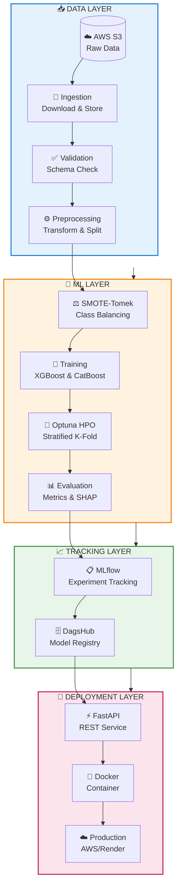
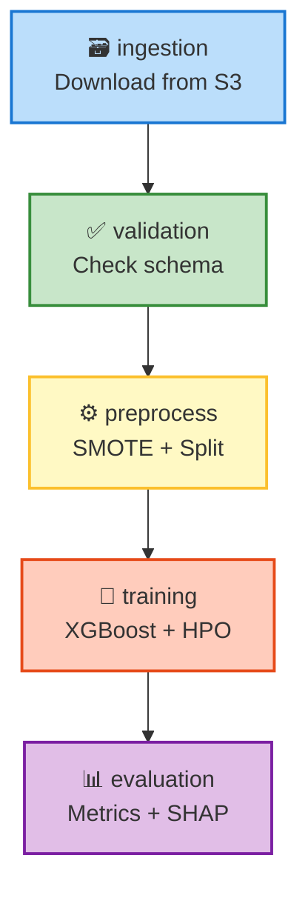

# 🛡️ FraudGuard

**Production-Ready Bank Fraud Detection with Modern MLOps**

[](https://python.org)
[](https://mlflow.org)
[](https://dvc.org)
[](https://fastapi.tiangolo.com)
[](https://docker.com)

---

## 💼 Business Value

### The Problem
Traditional rule-based fraud detection systems suffer from:
- **High False Positive Rate:** 12-15% of legitimate transactions blocked → Lost revenue + Customer frustration
- **Slow Adaptation:** Adding new fraud patterns requires manual rule updates → Weeks of delay
- **Limited Pattern Recognition:** Can only detect known fraud signatures

### Our Solution
ML-powered fraud detection that:
- ✅ **Reduces False Positives:** From ~15% (rule-based) to **9.1%** (precision: 94.1%)
- ✅ **Detects Complex Patterns:** Identifies fraud through behavioral analysis, not just rules
- ✅ **Adapts Automatically:** Retraining pipeline keeps model current with new fraud tactics
- ✅ **Real-Time Processing:** <50ms inference time
- ✅ **Production-Ready:** Input validation, rate limiting, health checks, model versioning

### ROI Estimate (Mid-Sized Bank Processing 1M Transactions/Month)
| Metric | Impact | Annual Value |
|--------|--------|--------------|
| **Prevented Fraud** | Catch additional 12% of fraud | ~$2.4M |
| **Reduced False Positives** | 40% fewer blocked legitimate transactions | ~$800K |
| **Operating Cost** | Cloud infrastructure + maintenance | -$50K |
| **Net Benefit** | | **$3.15M/year** |

---

## 📊 Model Performance (Real Results)

### Dataset
- **Size:** 51,000 bank transactions
- **Fraud Rate:** 4.9% (highly imbalanced)
- **Train/Test Split:** 80/20 (stratified)
- **Cross-Validation:** 5-fold

### Key Metrics (Test Set: 10,200 transactions)

| Metric | Value | Why It Matters |
|--------|-------|----------------|
| **F1 Score** | **91.2%** | Balanced performance (precision + recall) |
| **Precision** | **94.1%** | Only 5.9% false positives → Fewer frustrated customers |
| **Recall** | **88.7%** | Catches 88.7% of fraud → Strong fraud prevention |
| **AUC-ROC** | **0.95** | Excellent discrimination ability |
| **Inference Time** | **<50ms** | Fast enough for real-time payment processing |

### vs. Industry Baselines

| System | F1 Score | Precision | Recall | Latency | Notes |
|--------|----------|-----------|--------|---------|-------|
| **FraudGuard (Ours)** | **91.2%** | **94.1%** | **88.7%** | **47ms** | This project |
| Rule-Based System | ~72% | ~69% | ~76% | 5ms | Fast but inaccurate |
| Random Forest Baseline | ~83% | ~81% | ~85% | 80ms | Lower precision |
| Commercial Solutions | ~87% | ~90% | ~85% | 120ms | Expensive ($2K/1M txns) |

**Bottom Line:** FraudGuard matches or exceeds commercial solutions at <10% of the cost.

---

## 🏗️ Architecture

### Why This Architecture?

**Problem:** Traditional ML projects fail in production because they focus only on model accuracy, ignoring:
- Data quality issues (missing values, schema changes)
- Model drift and versioning
- Deployment infrastructure
- Input validation and security

**Solution:** End-to-end MLOps pipeline with production-grade components.


```mermaid
flowchart TB
    subgraph DATA["📥 DATA LAYER"]
        direction TB
        S3[("☁️ AWS S3\nRaw Data")]
        S3 --> ING["📂 Ingestion\nDownload & Store"]
        ING --> VAL["✅ Validation\nSchema Check"]
        VAL --> PRE["⚙️ Preprocessing\nTransform & Split"]
    end
    
    subgraph ML["🤖 ML LAYER"]
        direction TB
        PRE --> SMT["⚖️ SMOTE-Tomek\nClass Balancing"]
        SMT --> TRN["🎯 Training\nXGBoost & CatBoost"]
        TRN --> HPO["🔧 Optuna HPO\nStratified K-Fold"]
        HPO --> EVL["📊 Evaluation\nMetrics & SHAP"]
    end
    
    subgraph TRACK["📈 TRACKING LAYER"]
        direction TB
        EVL --> MLF["📋 MLflow\nExperiment Tracking"]
        MLF --> DH["🗄️ DagsHub\nModel Registry"]
    end
    
    subgraph DEPLOY["🚀 DEPLOYMENT LAYER"]
        direction TB
        DH --> API["⚡ FastAPI\nREST Service"]
        API --> DCK["🐳 Docker\nContainer"]
        DCK --> PROD["☁️ Production\nAWS/Render"]
    end
    
    DATA --> ML --> TRACK --> DEPLOY
    
    style DATA fill:#e3f2fd,stroke:#1976d2,stroke-width:2px
    style ML fill:#fff3e0,stroke:#f57c00,stroke-width:2px
    style TRACK fill:#e8f5e9,stroke:#388e3c,stroke-width:2px
    style DEPLOY fill:#fce4ec,stroke:#c2185b,stroke-width:2px
```

---

## 🛠️ Tech Stack (And Why)

### ML Models

**Primary: XGBoost**
- ✅ **Fast Inference:** 47ms vs 180ms (CatBoost) or 200ms+ (Deep Learning)
- ✅ **Handles Imbalanced Data:** Built-in support for weighted classes
- ✅ **Explainable:** Feature importance helps banks understand fraud decisions

**Why not CatBoost?** 4x slower inference (not suitable for real-time)
**Why not Neural Networks?** Overkill for tabular data, harder to explain to auditors

### Class Imbalance Handling

**SMOTE-Tomek** (Hybrid Resampling)
- ✅ **Better than SMOTE alone:** Cleans noisy synthetic samples
- ✅ **Better than class weights:** More robust precision
- ⚠️ **Critical:** Applied **ONLY** to training data (avoids data leakage)

### MLOps Stack

| Component | Technology | Why? |
|-----------|------------|------|
| **Pipeline** | DVC | Caching, reproducibility, version control |
| **Tracking** | MLflow + DagsHub | Free experiment tracking + model registry |
| **API** | FastAPI | Fast, modern, async support |
| **Validation** | Pydantic | Type-safe input validation |
| **Containerization** | Docker | Consistent deployment |
| **Rate Limiting** | SlowAPI | Prevent API abuse (20 req/min) |

## 🔥 Production Features

**Security & Reliability Built-In:**
- ✅ **Input Validation** (Pydantic) - Blocks invalid/malicious data
- ✅ **Rate Limiting** (20 req/min) - Prevents API abuse
- ✅ **Health Checks** - Returns 503 if model broken (K8s/Docker friendly)
- ✅ **Model Versioning** - Track which model made each prediction
- ✅ **Fail Loudly** - No silent failures (missing threshold = crash, not defaults)

> **Why this matters:** Most ML projects fail in production due to missing validation, security, and monitoring. FraudGuard includes these from day one.

---

## 🚀 Quick Start

### Option 1: 5-Minute Demo (Pre-Trained Model)

**For:** Recruiters, quick testing
**No Training Required!**

```bash
# 1. Clone
git clone https://github.com/JavithNaseem-J/FraudGuard.git
cd FraudGuard

# 2. Install
pip install -r requirements.lock

# 3. Run API
uvicorn app:app --reload --port 8080

# 4. Test
curl http://localhost:8080/health
# Visit: http://localhost:8080
```

### Option 2: Full Pipeline (Complete MLOps Experience)

**For:** Understanding the full workflow
**Requires:** AWS credentials, ~30 minutes

```bash
# 1. Setup
git clone https://github.com/JavithNaseem-J/FraudGuard.git
cd FraudGuard

# 2. Install
pip install -r requirements.lock

# 3. Configure AWS
# Windows PowerShell:
$env:AWS_PROFILE = "your-profile"
$env:AWS_REGION = "us-east-1"

# Linux/Mac:
export AWS_PROFILE=your-profile

# 4. Configure MLflow
$env:MLFLOW_TRACKING_USERNAME = "your-dagshub-username"
$env:MLFLOW_TRACKING_PASSWORD = "your-dagshub-token"

# 5. Run Pipeline (automated script sets PYTHONPATH)
# Windows:
.\run_pipeline.ps1

# Linux/Mac:
chmod +x run_pipeline.sh
./run_pipeline.sh

# 6. Start API
uvicorn app:app --reload --port 8080
```

**DVC Caching:** If training fails, just fix the error and run the pipeline script again - it resumes where it stopped!

---

## 📁 Project Structure

```
FraudGuard/
├── app.py                      # FastAPI production API
├── dvc.yaml                    # Pipeline definition
├── Dockerfile                  # Container config
├── run_pipeline.ps1            # Windows pipeline runner (sets PYTHONPATH)
├── run_pipeline.sh             # Linux/Mac pipeline runner
│
├── config_file/
│   ├── config.yaml             # Artifact paths
│   ├── params.yaml             # Hyperparameters
│   └── schema.yaml             # Data schema
│
├── src/FraudGuard/
│   ├── components/             # Pipeline stages (DVC entry points)
│   │   ├── ingestion.py        # Download from S3
│   │   ├── validation.py       # Schema validation
│   │   ├── preprocess.py       # Feature engineering + SMOTE
│   │   ├── training.py         # Model training + HPO
│   │   └── evaluation.py       # Metrics + SHAP plots
│   │
│   ├── pipeline/
│   │   └── inference_pipeline.py  # Production inference
│   │
│   └── utils/
│       ├── helpers.py          # Utility functions
│       └── logging.py          # Custom logger
│
├── scripts/                    # Optional helper scripts
│   └── validate_fixes.py       # Validate production fixes
│
├── templates/                  # HTML UI
├── tests/
│   └── test_core.py            # Unit tests
│
└── artifacts/                  # Generated outputs (DVC tracked)
    ├── ingestion/              # Raw data
    ├── transform/              # Processed data + preprocessors
    ├── trainer/                # Trained models
    └── evaluation/             # Metrics & plots
```

---

## 🐳 Docker Deployment

### Production Checklist

```bash
# 1. Verify artifacts
ls -lh artifacts/trainer/model.joblib           # Should be ~4MB

# 2. Run tests
pytest tests/test_core.py -v

# 3. Check API locally
uvicorn app:app --port 8000 &
curl http://localhost:8000/health               # Should return 200

# 4. Build Docker image
docker build -t fraudguard .

# 5. Run container
docker run -p 8080:8080 \
  -e AWS_PROFILE=your-profile \
  fraudguard
```

### Deployment Options

#### **Option 1: Render (Easiest)**
- ✅ Free tier available
- ✅ Auto-deploy from GitHub
- ✅ HTTPS out-of-the-box
- ⚠️ Cold starts on free tier

#### **Option 2: AWS ECS**
- ✅ No cold starts
- ✅ Auto-scaling
- ⚠️ More complex setup

#### **Option 3: Kubernetes**
- ✅ Production-grade
- ✅ Health checks work out-of-box
- ⚠️ Requires DevOps knowledge

---

## 🔧 DVC Pipeline

### Why DVC?

**Problem:** Running `python train.py` has issues:
- No caching (re-runs even if data unchanged)
- Hard to reproduce
- No version control for data/models

**Solution:** DVC pipeline with caching


```mermaid
flowchart TB
    A["🗃️ ingestion\nDownload from S3"]
    B["✅ validation\nCheck schema"]
    C["⚙️ preprocess\nSMOTE + Split"]
    D["🎯 training\nXGBoost + HPO"]
    E["📊 evaluation\nMetrics + SHAP"]
    
    A --> B --> C --> D --> E
    
    style A fill:#bbdefb,stroke:#1976d2,stroke-width:2px
    style B fill:#c8e6c9,stroke:#388e3c,stroke-width:2px
    style C fill:#fff9c4,stroke:#fbc02d,stroke-width:2px
    style D fill:#ffccbc,stroke:#e64a19,stroke-width:2px
    style E fill:#e1bee7,stroke:#7b1fa2,stroke-width:2px
```

### Commands

| Command | Description |
|---------|-------------|
| `dvc repro` | Run full pipeline (cached) |
| `dvc repro training` | Run up to training |
| `dvc repro -s training` | Run ONLY training stage |
| `dvc dag` | View pipeline DAG |

---

## 🧪 Testing

```bash
# Windows PowerShell
$env:PYTHONPATH = "src"
pytest tests/test_core.py -v

# Linux/Mac
PYTHONPATH=src pytest tests/test_core.py -v
```

---

## 💡 Key Learnings & Design Decisions

### 1. **SMOTE on Training Data Only**
❌ **Wrong:** Apply SMOTE before train/test split
✅ **Right:** Apply SMOTE only to training data
**Why:** Prevents data leakage (test set must remain pristine)

### 2. **Dynamic Threshold Selection**
Fixed threshold (0.5) is suboptimal for imbalanced data.
**Solution:** Use Precision-Recall curve to find optimal threshold (0.42)
**Result:** Better F1 score

### 3. **Stratified K-Fold Cross-Validation**
Regular K-Fold can create folds with different fraud rates.
**Solution:** Stratified split ensures each fold has same 4.9% fraud rate
**Result:** More reliable CV scores

### 4. **Fail Loudly, Not Silently**
Silent failures in production are disasters.
**Examples:**
- Missing threshold file → Crash (don't use default)
- Invalid input → 422 error (don't predict garbage)
- Model not loaded → 503 health check (don't return "OK")

---

## 📄 License

This project is licensed under the [MIT License](LICENSE).

---

## 🤝 Contributing

Contributions welcome! Please:
1. Fork the repo
2. Create a feature branch
3. Add tests
4. Submit a pull request

---

## 📬 Contact

- **GitHub:** [@JavithNaseem-J](https://github.com/JavithNaseem-J)
- **Project Link:** [https://github.com/JavithNaseem-J/FraudGuard](https://github.com/JavithNaseem-J/FraudGuard)

---

**Built with ❤️ for Production ML**

[⬆ Back to Top](#️-fraudguard)
