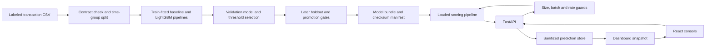

# FraudGuard

**Transaction fraud scoring with a chronological holdout, cost-selected decisions, and a browser-to-model.**

Click Here: [Live](https://fraudguard-gapd.onrender.com)

Python · FastAPI · LightGBM · scikit-learn · React · TypeScript · Supabase · Docker

FraudGuard scores transaction rows for fraud review. Its offline workflow trains from labeled transactions, chooses a model and operating threshold on a later validation period, and reports performance on a still later holdout. A React console accepts CSV or JSON, calls the FastAPI service, and displays predictions and a recent-activity dashboard. This is a bounded demonstration, not an automated payment-blocking system.


## Evidence

The saved full-data report records 590,540 labeled rows split chronologically into 413,378 training, 88,581 validation, and 88,581 holdout rows. The selected LightGBM pipeline (`lgbm-05`) and its 0.02826 threshold were chosen on validation data. The later holdout contained 3,083 fraud labels.

| Holdout metric | Numeric logistic baseline | Selected LightGBM |
|---|---:|---:|
| Average precision | 0.145 | **0.540** |
| Fraud recall | 0.595 | **0.781** |
| Mean modeled error cost per row | 0.434 | **0.262** |

Cost assigns 1 unit to a false positive and 20 to a false negative; these are demo assumptions, not measured financial losses. At the selected threshold the holdout has 2,407 true positives, 9,645 false positives, and 676 false negatives. The model score is **not calibrated** as a real-world fraud probability. Figures come from the locally saved `artifacts/benchmark/transaction_data/strong_benchmark_report.json`; generated data and artifacts are ignored by Git, and this audit did not rerun training.

## Architecture


```mermaid
flowchart LR
    Data["Labeled transaction CSV"] --> Split["Contract check and time-group split"]
    Split --> Fit["Train-fitted baseline and LightGBM pipelines"]
    Fit --> Select["Validation model and threshold selection"]
    Select --> Holdout["Later holdout and promotion gates"]
    Holdout --> Bundle["Model bundle and checksum manifest"]
    Bundle --> Model["Loaded scoring pipeline"]
    Browser["React console"] --> API["FastAPI"]
    API --> Guards["Size, batch and rate guards"]
    Guards --> Model
    Model --> API
    API --> Store["Sanitized prediction store"]
    Store --> Dashboard["Dashboard snapshot"]
    Dashboard --> Browser
```

- `src/FraudGuard/data/transaction_benchmark.py` deduplicates exact rows, keeps equal `TransactionDT` groups together, and uses the labeled file alone for the approximately 70/15/15 split. The public `test_transaction.csv` is unlabeled and used for schema or inference checks, not performance metrics.
- The LightGBM preprocessing and feature engineering are serialized with the classifier. `TransactionPipeline` requires the release feature list, orders request fields accordingly, and applies the stored threshold to positive-class scores.
- `app.py` serves the compiled console and API from one process. It loads a configured local bundle or a checksum-validated private Supabase release before reporting `/ready`.
- Successful scores create sanitized records containing score, threshold, decision, amount, timing, and release metadata. Supabase is optional; without credentials, the dashboard uses bounded process memory. Upstash rate limiting is also optional, with a local per-process fallback.

### Engineering choices

**Out-of-time evaluation.** Each time group belongs to one partition, making the holdout a later period. Within the saved run, preprocessing, model, and threshold were fixed before holdout scoring. The report records eight passing release gates, but Git history shows that gate thresholds were relaxed after earlier holdout results. Treat this as a documented development result, not a prospectively locked final test. Publication and deployment are separate actions.

**A threshold tied to an explicit cost policy.** Candidate selection prioritizes the validation recall constraint and modeled error cost. The chosen threshold minimizes validation cost under the 1:20 assumption; the report also records sensitivity at other cost ratios. Ranking quality, decision recall, and modeled cost are reported separately.

**Artifact integrity at startup.** Release manifests list four payload files with sizes and SHA-256 hashes. The publisher uploads the manifest last; the loader checks local or downloaded files before loading the model. `/live` remains available if model loading fails, while `/ready` returns 503.

## Run locally

Use Python 3.11–3.13 and Node 20. The Git checkout does **not** include the model or source data. Supply a locally available, promotion-approved bundle and point `TRANSACTION_ARTIFACT_ROOT` to its directory (containing `model.joblib`, `metadata.json`, `threshold.json`, and `feature_audit.json`). The locally saved approved bundle is `artifacts/releases/tx-20260927-001/active`; it is not in a clean clone. Alternatively, configure a private release with `TRANSACTION_ARTIFACT_RELEASE_ID` and server-side Supabase credentials from [.env.example](.env.example).

```powershell
python -m pip install -r requirements-dev.lock
python -m pip install -e . --no-deps
$env:TRANSACTION_ARTIFACT_ROOT = "artifacts/releases/tx-20260927-001/active"
npm --prefix frontend ci
npm --prefix frontend run build
python app.py
```

Open `http://localhost:8000/` for the console, `/score` to submit rows, `/schema/transactions` for the exact required fields, and `/docs` for API documentation. The default API batch limit is 100 rows. The UI reads the first scoring batch of an uploaded CSV; it does not process an entire large file.

## Verification

Place the labeled `train_transaction.csv` and optional unlabeled `test_transaction.csv` under `data/`. The full release workflow needs sufficient memory and more time than the bounded diagnostic. `dvc.yaml` declares the 75,000-row diagnostic; `--release` is the full-data command. Its result goes to `artifacts/benchmark/transaction_data/evaluated-model` and does not automatically replace the serving bundle.

```powershell
python -m scripts.transaction_benchmark --release
python -m scripts.validate_transaction_release --artifact-root artifacts/benchmark/transaction_data/evaluated-model --public-test data/test_transaction.csv --rows 1000
python -m pytest -p no:cacheprovider -m "not integration"
python -m pytest -p no:cacheprovider -m integration
npm --prefix frontend test
```

The repository also defines formatting, type, frontend build, container smoke, and exact-commit Render deployment checks in `.github/workflows/`. These commands and checks were inspected for this README; they were not executed in this audit. The current `dvc.lock` does not match the latest benchmark source, so it must be refreshed before treating DVC status as reproducibility evidence.

## Limits

- The score is uncalibrated, and the 1:20 cost ratio is an assumed review policy. There are no delayed production labels, customer-specific costs, or measured real-world savings.
- For unseen `card1` or `addr1` groups, one engineered amount-ratio fallback uses the mean of the current scoring batch. Single-row and multi-row predictions may therefore differ for the same transaction; this needs a fixed training-derived fallback before relying on batch invariance.
- Scoring is anonymous. The current public dashboard clear endpoints delete all stored predictions, and the UI Clear button can trigger on a single click. Use the hosted dashboard as a shared demo, not an audit record or protected analyst workspace.
- Supabase writes are best effort; a prediction can succeed with `persisted_count=0`. Local fallback history is lost on restart. Output drift reporting is manual through `scripts/generate_monitoring_report.py`; no continuous monitoring or automatic retraining is implemented.

## FutureWork

1. **Control access and deletion.** Add authentication and scoped authorization. Remove public bulk deletion or restrict it to an owner with server-side confirmation.
2. **Make scoring consistent.** Replace the batch-dependent fallback with a training-derived value. Calibrate scores if presenting them as probabilities. Evaluate on a fresh later-period holdout with gates fixed in advance and operator-agreed costs.
3. **Operate with evidence.** Make persistence failures recoverable; schedule retention, service/error monitoring, drift checks, and trustworthy delayed-label evaluation.
4. **Prove repeatable releases.** Publish shareable metrics and dataset provenance, refresh the DVC lock, and verify the deployed commit, release, schema, and load behavior.

Licensed under the [MIT License](LICENSE).
